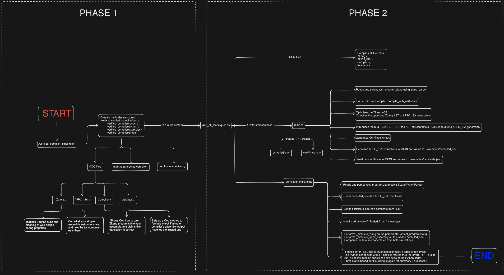

# Formally Verified Compiler Pipeline: ZLang → APPC_ISA

This project implements a complete formally verified compiler pipeline demonstrating three key verification techniques:

## Languages

### ZLang (Source Language)

- Minimal imperative language
- Features: arithmetic expressions, variable assignments, statement sequencing
- No loops or functions (for simplicity)
- Example: `x = 2 + 3; y = x * 4`

### APPC_ISA (Target Language)

- PowerPC-like assembly language
- Instructions: LOAD, LOADVAR, STORE, ADD, SUB, MUL, NOP
- Register-based architecture with 8 registers (R0-R7)

## Verification Techniques

### Technique 1: Verified Compiler (Coq)

- **Location**: `coq/` directory
- **Purpose**: Trusted reference compiler with formal correctness proof
- **Key Files**:
  - `ZLang.v`: ZLang syntax and operational semantics
  - `APPC_ISA.v`: Assembly language definition and execution semantics
  - `Compiler.v`: Compilation algorithm with correctness theorem
- **Theorem**: `∀ S, s, s'. eval_zlang(S, s, s') → exec_appc(compile(S), s) = s'`

### Technique 2: Verified Validator (Coq + Rust)

- **Location**: `coq/Validator.v` + `rust/` directory
- **Purpose**: Validate untrusted compiler output against trusted specification
- **Process**:
  1. Untrusted Rust compiler produces assembly code
  2. Coq validator performs symbolic execution comparison
  3. Validation ensures semantic equivalence
- **Theorem**: `Validate(S, C) = true → S ≡ C`

### Technique 3: Certificate Checker (Python)

- **Location**: `python/certificate_checker.py`
- **Purpose**: Verify compiler optimizations using certificates
- **Features**:
  - Constant folding verification
  - Dead code elimination checking
  - Semantic preservation validation
- **Certificate**: Compiler emits optimization log for independent verification

## Usage

### Quick Start

```bash
./verified_compiler_pipeline.sh
cd verified_compiler/examples
./run_all_techniques.sh
```

### Individual Components

#### 1. Coq Verified Compiler

```bash
cd coq/
coq_makefile -f _CoqProject *.v -o Makefile
make
```

#### 2. Rust Untrusted Compiler

```bash
cd rust/
cargo run
```

#### 3. Python Certificate Checker

```bash
python3 python/certificate_checker.py examples/certificate.json
```

## Project Structure

```
verified_compiler/
├── coq/                    # Technique 1: Verified Compiler
│   ├── ZLang.v            # Source language definition
│   ├── APPC_ISA.v         # Target language definition
│   ├── Compiler.v         # Compilation + correctness proof
│   └── Validator.v        # Technique 2: Validation logic
├── rust/                   # Technique 2: Untrusted Compiler
│   ├── Cargo.toml
│   └── src/main.rs        # Optimizing compiler + certificates
├── python/                 # Technique 3: Certificate Checker
│   └── certificate_checker.py
├── examples/              # Test programs and integration
│   ├── test_program.zlang
│   ├── run_all_techniques.sh
│   ├── compiled.json      # Generated assembly
│   └── certificate.json   # Generated certificates
└── README.md
```

## Verification Guarantees

1. **Soundness**: Verified compiler preserves program semantics
2. **Completeness**: Validator catches incorrect transformations
3. **Transparency**: Certificates enable independent verification
4. **Composability**: All three techniques work together

## Example Verification Flow

1. **Input**: `x = 2 + 3; y = x * 0 + 5`
2. **Technique 1**: Coq proves compilation correctness
3. **Technique 2**: Rust compiles with optimizations, Coq validates
4. **Technique 3**: Python verifies optimization certificates
5. **Output**: Provably correct assembly code

## Dependencies

- **Coq** (8.13+): For formal verification
- **Rust** (1.60+): For untrusted compiler
- **Python** (3.8+): For certificate checking
- Standard build tools (make, cargo, etc.)

## Academic Context

This implementation demonstrates formal methods in compiler verification:

- **Translation Validation**: Technique 2 approach
- **Proof-Carrying Code**: Similar to Technique 3 certificates
- **Verified Compilation**: Technique 1 foundational approach

The combination provides multiple layers of assurance for compiler correctness.

---



---

| Technique from Prof                      | Key File(s) in the Project                           | How it Happens in the Pipeline                                                                                                                                                                                                                                                                                                                   |
| :--------------------------------------- | :--------------------------------------------------- | :----------------------------------------------------------------------------------------------------------------------------------------------------------------------------------------------------------------------------------------------------------------------------------------------------------------------------------------------- |
| **(a) Compiler Verification**            | `coq/Compiler.v`                                     | A **trusted** ZLang->APPC*ISA compiler is defined and its correctness theorem is \_stated* in Coq. This framework is type-checked when you run `make` in the `coq` directory.                                                                                                                                                                    |
| **(b) Validator Verification**           | `coq/Validator.v` & `python/certificate_checker.py`  | **Formal:** The _goal_ of proving `APPC_from_Rust ≡ APPC_from_Coq` is stated as a theorem in `Validator.v` (checked by `make`).<br>**Heuristic/Practical:** The Python script _executes_ this comparison by simulating ZLang (`A'`'s semantics) and `compiled.json` (`A`) and checking if final states match. This is where your bug was caught. |
| **(c) Certificate-Checker Verification** | `rust/src/main.rs` & `python/certificate_checker.py` | **Rust compiler** generates a _real_ certificate (`certificate.json`). **Python script** loads and checks the claims within this certificate. This is a complete, dynamic workflow demonstration.                                                                                                                                                |

---

[Check how this is different from my previous approach](comparison_between_approaches.md)

[Check the demo video too](execution_video_.mp4)
